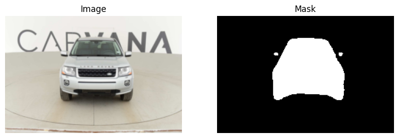
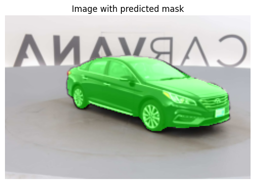

# U-Net Architecture for Image Segmentation

This project implements the U-Net architecture for **image segmentation**. The U-Net model is designed to work with segmentation tasks but can be applied to any image segmentation problem. This implementation is built using **PyTorch** with data from [Kaggle](https://www.kaggle.com/competitions/carvana-image-masking-challenge/overview).

## Table of Contents
- [Introduction](#introduction)
- [Features](#features)
- [Requirements](#requirements)
- [Installation](#installation)
- [Usage](#usage)
- [Evaluation](#evaluation)
- [Results](#results)

## Introduction
The U-Net architecture is a type of convolutional neural network (CNN) used for semantic segmentation. It has an encoder-decoder structure with skip connections to help preserve spatial information. This repository provides a PyTorch implementation of U-Net for image segmentation tasks.

## Features
- **Encoder-Decoder Architecture**: U-Net consists of a contracting path (encoder) and an expansive path (decoder).
- **Skip Connections**: Skip connections between the encoder and decoder help the model retain spatial information.
- **Data Augmentation**: Built-in data augmentation for better generalization.

## Requirements
- ipykernel==6.29.5
- kaggle==1.6.17
- matplotlib==3.10.0
- Other dependencies (see [Installation](#installation))

## Installation
Clone this repository and install requirements
```bash
git clone https://github.com/kevingeorgedev/Car-Segmentation-UNET.git
cd Car-Segmentation-UNET

pip install -r requirements.txt
```
In addition to requirements.txt, you must install PyTorch from their [website](https://pytorch.org/get-started/locally/).

## Usage
After installing the repository and setting up your environment, you can use the model to perform image segmentation.

## Evaluation
To evaluate the model I took the dice score, intersection over union score, and accuracy of the model. The metric tests are shown below and were taken after 3 epochs.
| Metric     | Value  |
|------------|--------|
| IoU        | ~0.975 |
| Dice Score | ~0.987 |
| Accuracy   | ~99.5% |

## Results

Side by side of a test image vs. its predicted mask:



Mask applied over a test image:

